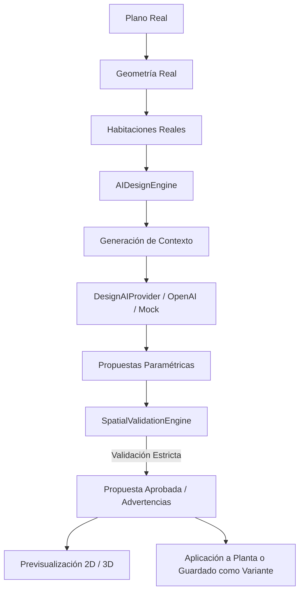

# HBD — AI Design & Interiorism Engine (V8.0.0)

**Autor Oficial:** Adrián Palma  
**Copyright:** © 2026 Adrián Palma — HBD (Home Board Designer)  
**Versión:** 8.0.0  

---

## 1. Visión General

El **Motor de IA de Diseño e Interiorismo** de HBD (Versión 8.0.0) permite la generación y optimización automática de distribuciones interiores, mobiliario, materiales e iluminación basándose estrictamente en **la geometría arquitectónica real** de la vivienda.



---

## 2. Principio Fundamental de Aislamiento y No-Alucinación

HBD **no es un generador de imágenes ciego**. Todo diseño sugerido por IA se somete a validación espacial contra:
- Polígonos y perímetros de paredes reales.
- Radios de apertura y barrido de puertas batientes y correderas.
- Zonas de paso y pasillos mínimos requeridos (0.70 m - 0.90 m).
- Ventanas y puntos de entrada de luz natural.
- Colisiones entre piezas de mobiliario.

> [!IMPORTANT]
> **La IA propone, los motores geométricos y de validación espacial disponen.** Si una pieza colisiona o bloquea un paso vital, el sistema reporta el fallo espacial de forma visual y cuantitativa.

---

## 3. Arquitectura y Componentes

### 3.1 Proveedores de IA (`DesignAIProvider`)
- **`MockDesignAIProvider`**: Proveedor determinista sin dependencias externas, ideal para desarrollo, pruebas offline y suites de integración continua.
- **`OpenAiDesignProvider`**: Integración con modelos LLM mediante Structured Outputs (JSON Schema) para interpretar intenciones complejas, estilos decorativos y generar distribuciones inteligentes.

### 3.2 Contexto de Diseño (`DesignContext`)
Empaqueta toda la geometría espacial relevante:
```typescript
interface DesignContext {
  projectId: string;
  projectName: string;
  floorId: string;
  targetRoomId?: string;
  room?: RoomGeometryDto;
  walls: WallGeometryDto[];
  doors: DoorGeometryDto[];
  windows: WindowGeometryDto[];
  existingFurniture: FurniturePlacementDto[];
  preferences: DesignPreferences;
}
```

### 3.3 Asistente Copilot (`AICopilotBar`)
Permite instrucciones conversacionales en lenguaje natural como:
- *"Haz este salón más minimalista."*
- *"Coloca el sofá frente al ventanal y añade una mesa de centro de madera clara."*
- *"¿Cabe una mesa de comedor para 6 personas?"*

Las órdenes se transforman en acciones estructuradas (`AIAction`) que se validan y aplican instantáneamente sobre el plano 2D y el gemelo 3D.

### 3.4 Variantes de Diseño (`DesignVariant`)
Permite guardar propuestas alternativas (ej. Opción A, Opción B, Opción C) como deltas y modificaciones de mobiliario/materiales/luces sin duplicar ni alterar destructivamente el modelo geométrico base.

---

## 4. Endpoints API REST

| Método | Endpoint | Descripción | Roles Permitidos |
|---|---|---|---|
| `POST` | `/api/ai/design/analyze-room` | Análisis arquitectónico de la habitación seleccionada | `ADMIN`, `ARCHITECT`, `DESIGNER`, `VIEWER` |
| `POST` | `/api/ai/design/analyze-project` | Análisis global de distribución del inmueble | `ADMIN`, `ARCHITECT`, `DESIGNER`, `VIEWER` |
| `POST` | `/api/ai/design/proposals` | Genera 1 a 3 propuestas con validación espacial | `ADMIN`, `ARCHITECT`, `DESIGNER`, `VIEWER` |
| `POST` | `/api/ai/design/copilot` | Procesa comandos de lenguaje natural y devuelve acciones | `ADMIN`, `ARCHITECT`, `DESIGNER`, `VIEWER` |
| `POST` | `/api/ai/design/apply` | Aplica una propuesta directamente a la planta activa | `ADMIN`, `ARCHITECT`, `DESIGNER` |
| `POST` | `/api/ai/design/save-variant` | Guarda una propuesta como variante de diseño | `ADMIN`, `ARCHITECT`, `DESIGNER` |
| `GET` | `/api/ai/design/variants/:floorId` | Lista las variantes de diseño de una planta | Todos |
| `GET` | `/api/ai/design/history/:floorId` | Historial de generaciones IA de una planta | Todos |
