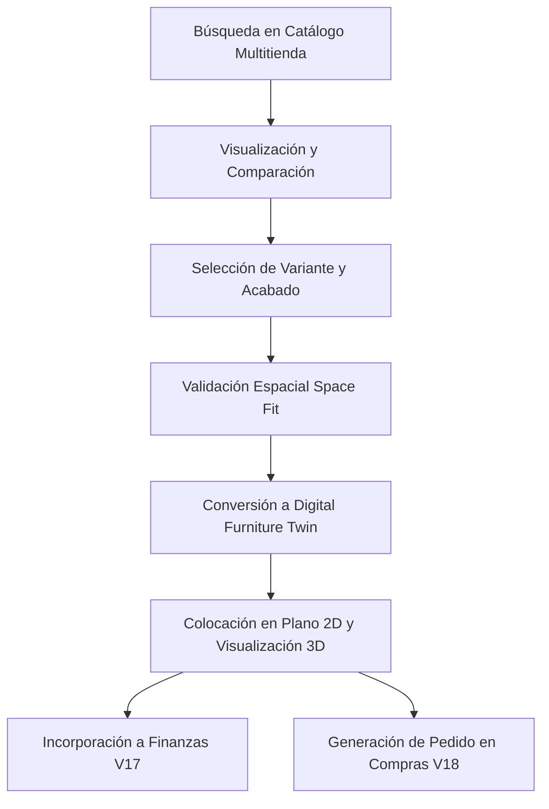

# HBD V20.0.0 — Connected Retail Catalog & Product Placement

**Autor:** Adrián Palma  
**Copyright:** © 2026 Adrián Palma. Todos los derechos reservados.

---

## 1. Visión General

El módulo **Connected Retail Catalog & Product Placement** (V20.0.0) dota a HBD de la capacidad de buscar, comparar, validar espacialmente y colocar en proyectos arquitectónicos productos de los principales comercios de mobiliario, bricolaje y decoración (IKEA, Leroy Merlin, Kave Home, Conforama, etc.).

A diferencia de un scraper tradicional, este sistema implementa:
1. **Arquitectura de Conectores Normalizados:** Conectores desacoplados y con aislamiento de fallos para cada retailer (`IRetailConnector`).
2. **Motor de Calidad de Datos:** Puntuación de completitud y validación estricta de dimensiones y precios (`ProductDataQualityService`).
3. **Motor de Matching Multitienda:** Detección de equivalencias y similitudes dimensionales entre distintas tiendas (`ProductMatchingEngine`).
4. **Validación Espacial Automática:** Comprobación de compatibilidad con habitaciones, holguras de paso y barridos de puertas (`GeometryEngine` / `SpaceFitValidation`).
5. **Conversión a Digital Furniture Twin:** Transformación de productos de catálogo en muebles 2D/3D con trazabilidad completa de procedencia.
6. **Integración Transversal:** Vinculación directa con el Presupuesto y Coste Total de Inversión (V17) y con la Planificación de Aprovisionamiento y Compras (V18).

---

## 2. Flujo de Trabajo



---

## 3. Arquitectura del Sistema

### 3.1 Backend
- **`RetailerRegistry` (`server/src/connectors/retailer.registry.ts`):** Registro centralizado y gestión del ciclo de vida de los conectores de tienda. Implementa aislamiento de fallos (circuit breaker / error boundary) y caché en memoria.
- **Conectores Implementados:**
  - `IkeaConnector` (IKEA España)
  - `LeroyMerlinConnector` (Leroy Merlin)
  - `KaveHomeConnector` (Kave Home)
  - `ConforamaConnector` (Conforama)
  - `MockRetailConnector` (Dataset de pruebas exhaustivo y reproducible)
- **`RetailSearchEngine` (`server/src/services/retailSearch.engine.ts`):** Motor de búsqueda federada multitienda con soporte para filtros por categoría, rango de precios, disponibilidad de stock y ordenación.
- **`ProductDataQualityService` (`server/src/services/productDataQuality.service.ts`):** Auditoría en tiempo real de la fiabilidad de los datos de producto.
- **`ProductMatchingEngine` (`server/src/services/productMatching.engine.ts`):** Algoritmo de similitud de texto, categoría y dimensiones para comparar productos entre tiendas.
- **`RetailPlacementService` (`server/src/services/retailPlacement.service.ts`):** Generación de muebles digitales, validación geométrica de espacio e inserción automática en finanzas (V17) y aprovisionamiento (V18).
- **Controlador y Rutas:** `GET /api/catalog/search`, `GET /api/catalog/products/:id`, `GET /api/catalog/retailers`, `POST /api/catalog/projects/:id/add-product`, `POST /api/catalog/validate-fit`.

### 3.2 Frontend
- **`RetailCatalogPage` (`client/src/pages/RetailCatalogPage.tsx`):** Interfaz completa de catálogo con búsqueda global, filtros de facetas, vista en cuadrícula y selector de proyecto.
- **`RetailProductCard`:** Tarjeta interactiva con indicadores de retailer, dimensiones, stock, precio y botones de acción rápida.
- **`RetailProductDetailModal`:** Ficha de producto con selector de variantes, galería de imágenes, ficha técnica y evaluación de calidad.
- **`RetailProductComparisonModal`:** Comparador visual lado a lado con análisis de similitud dimensional y delta de precio.
- **`AddToProjectModal`:** Asistente de validación espacial en tiempo real y colocación directa en habitación con cálculo de impacto económico.
- **`RetailerAdminSettingsTab` (`client/src/features/retail-catalog/RetailerAdminSettingsTab.tsx`):** Panel de administración en Configuración para activar/desactivar conectores, configurar credenciales y forzar sincronizaciones.

---

## 4. Persistencia y Base de Datos

Se añadieron los siguientes modelos a Prisma ORM (`server/prisma/schema.prisma`):

```prisma
model Retailer {
  id               String    @id @default(uuid())
  code             String    @unique
  name             String
  websiteUrl       String
  country          String    @default("ES")
  currency         String    @default("EUR")
  isEnabled        Boolean   @default(true)
  apiEndpoint      String?
  apiKeyEncrypted  String?
  syncFrequencyHours Int     @default(24)
  lastSyncAt       DateTime?
  status           String    @default("active")
  createdAt        DateTime  @default(now())
  updatedAt        DateTime  @updatedAt
}

model ProductFavorite {
  id         String   @id @default(uuid())
  userId     String
  user       User     @relation(fields: [userId], references: [id], onDelete: Cascade)
  productId  String
  retailerId String
  createdAt  DateTime @default(now())

  @@unique([userId, productId])
}
```

---

## 5. Pruebas y Validación

La suite de pruebas automatizada `server/src/__tests__/v20-retail-catalog.test.ts` valida los 12 escenarios fundamentales:
1. Búsqueda de producto (KALLAX) en IKEA.
2. Manejo de variantes con precios y referencias individuales.
3. Búsqueda multitienda con filtros de categoría, precio y stock.
4. Aislamiento de fallos de conectores.
5. Omisión de conectores deshabilitados.
6. Puntuación de calidad de datos (Data Quality Score).
7. Matching y detección de similitudes entre catálogos.
8. Validación de ajuste espacial (Space Fit) con `GeometryEngine`.
9. Creación de Digital Furniture Twin y posición 2D.
10. Generación automática de partidas de coste en V17 (Total Cost Intelligence).
11. Generación de ítems de aprovisionamiento en V18 (ProcurementEngine).
12. Inmutabilidad de los costes del proyecto ante variaciones en tiendas externas.
