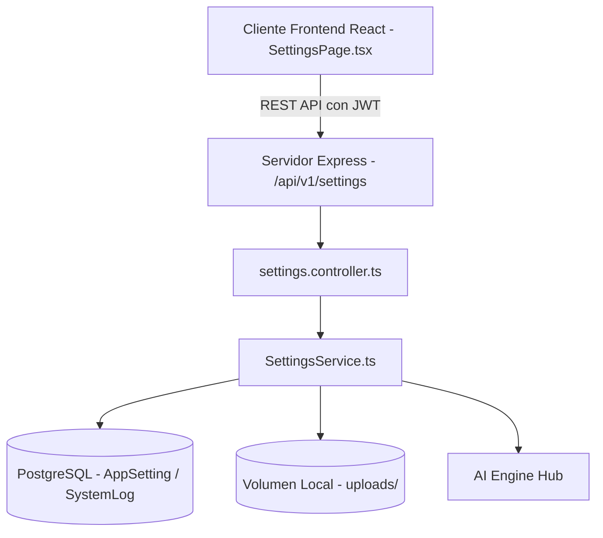

# HBD — Configuración y Gestión del Sistema (V19.0.0)

**Autor:** Adrián Palma  
**Copyright:** © 2026 Adrián Palma — HBD (Home Board Designer). Todos los derechos reservados.

---

## 1. Visión General del Módulo

La versión **V19.0.0** de HBD convierte el área de **Configuración** en un centro integral, reactivo y 100% conectado al backend para la administración de preferencias globales, políticas de seguridad, monitorización de recursos técnicos y gestión de usuarios.

Se eliminan completamente los placeholders estáticos y se proporciona persistencia real mediante el modelo `AppSetting` y el motor `SettingsService`.

---

## 2. Los 12 Apartados de Configuración

| # | Pestaña | Propósito & Capacidades Clave |
|---|---|---|
| **1** | **Apariencia** | Modo de tema (*Dark / Light / System*), paletas de acento predefinidas, selector HEX personalizado en vivo, radio de bordes (8px, 12px, 16px) y densidad de interfaz (*compact, normal, comfortable*). |
| **2** | **Idioma** | Soporte bilingüe completo Español / Inglés vía i18n con cambio en tiempo real y persistencia en el perfil de usuario. |
| **3** | **Cuenta** | Datos de perfil del usuario en sesión, correo electrónico, nombre, rol asignado y acceso directo a cambio de contraseña. |
| **4** | **Usuarios** | Panel de administración de usuarios (listar, crear, editar datos/rol, activar/desactivar y eliminación protegida). |
| **5** | **Roles** | Matriz RBAC de roles (`ADMIN`, `DESIGNER`, `USER`, `VIEWER`) y catálogo de permisos granulares por módulo. |
| **6** | **General** | Configuración de unidades de longitud (`m`, `cm`, `mm`), superficie (`m²`, `sqft`), divisas (`EUR`, `USD`, `GBP`), formatos de fecha y confirmaciones de borrado. |
| **7** | **Proyectos** | Parámetros estructurales estándar para nuevos proyectos: altura de techo (2.60 m), grosor de muro (0.15 m), tipo de inmueble y vistas iniciales. |
| **8** | **IA y Visión** | Configuración del motor de Inteligencia Artificial (V8/V13) y Visión (V9): selección de proveedor (*Mock / OpenAI / Gemini*), temperatura, y claves de API enmascaradas (`••••••••1234`). |
| **9** | **Almacenamiento** | Métricas de huella de almacenamiento: tamaño de base de datos PostgreSQL, volumen de imágenes/renders, y herramienta de purga de archivos temporales. |
| **10** | **Seguridad** | Requisitos de complejidad de contraseña, caducidad de tokens de sesión JWT, y visor de registros de auditoría de seguridad (`SystemLog`). |
| **11** | **Sistema** | Diagnóstico técnico de nodos de arquitectura (*Frontend, Backend, PostgreSQL, Storage, AI*), métricas de memoria heap y tiempo de actividad. |
| **12** | **Acerca de** | Identidad oficial, autoría de Adrián Palma, copyright unificado y visualización exclusiva de la versión `19.0.0`. |

---

## 3. Arquitectura Técnica & Seguridad

### Principios de Seguridad Implementados:
- **Protección de Administradores:** Impide la eliminación de la propia cuenta en sesión y bloquea la desactivación/eliminación del último administrador activo.
- **Enmascaramiento de Claves de API:** Las claves de IA almacenadas nunca se devuelven en texto plano al cliente; se ocultan mostrando únicamente los últimos 4 caracteres.
- **Auditoría Sistemática:** Todas las modificaciones de configuración se registran en la tabla `system_logs`.

---

## 4. Pruebas y Verificación

La suite de pruebas automatizadas `v19-settings-system.test.ts` valida:
1. Persistencia y recuperación de preferencias generales.
2. Parámetros de geometría de proyectos por defecto.
3. Enmascaramiento y persistencia de configuración de IA.
4. Estimación de almacenamiento y limpieza de temporales.
5. Políticas de seguridad y contraseñas.
6. Salud técnica y diagnósticos en tiempo real.
7. Restablecimiento por sección a valores de fábrica.
8. Auditoría estricta de versión centralizada exclusivamente en "Acerca de".
